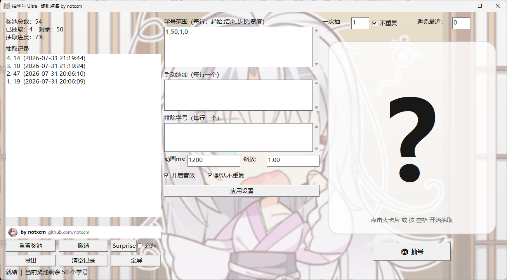

# 🎲 抽学号 Ultra · 随机点名

> 一个**单文件、原生 Win32、全 UTF-8** 的随机抽学号（课堂点名）程序。
> 双击即用，无需安装，拷到任何 Windows 10 / 11 电脑都能跑。

by **notxcm** · [GitHub 主页](https://github.com/notxcm)

---

## ✨ 核心特性

| 特性 | 说明 |
|---|---|
| 🎯 **学号来源三合一** | 数字范围 + 手动添加 + 排除名单，覆盖所有点名场景 |
| 🎬 **滚动抽取动画** | 大卡片高速"翻牌"缓动停下，配合清脆提示音，课堂氛围拉满 |
| 🔁 **不重复抽取** | 抽过的学号自动移出奖池（可关），直到奖池抽空 |
| 👥 **一次抽取 N 个** | 右上角「一次抽取」填数字，一口气抽多人 |
| 🕐 **避免最近** | 设置"避免最近 K 个"，抽中的短期内不再出现，分布更均匀 |
| 📋 **历史记录** | 左侧列表按时间倒序记录每次抽取，支持撤销、清空 |
| 📤 **导出 CSV** | UTF-8(带 BOM)，Excel 直接打开不乱码 |
| 🖼️ **图片半透明背景** | 高清动漫背景 + 半透明白蒙版，文字始终清晰，无花哨配色 |
| ⚙️ **设置平铺** | 学号范围/手动/排除/动画/缩放/音效/不重复，主界面直接编辑，无需弹窗 |
| 🎁 **Surprise 惊喜** | 填入幸运数字 + 勾选「必选」，抽取时第一个必中；不勾选则一切照常 |
| 🖥️ **高 DPI 自适应** | 4K / 高分屏清晰不模糊 |
| 🖵 **全屏模式** | F11 一键全屏，适合投屏 |
| 💾 **自动保存** | 关闭时自动记住全部配置与记录，下次打开原样恢复 |
| 📦 **单文件便携** | 背景图/头像/图标全部嵌入 exe，拷贝即用 |

---

## 📸 运行效果



> 界面三栏布局：左侧统计与抽取记录（底部署名条 by notxcm，点击跳转 GitHub）、中间设置面板、右侧大数字卡片与抽号按钮。

---

## 🚀 快速开始

1. 双击 `抽学号Ultra.exe`。
2. 默认奖池是 1~50。点击中间的大卡片（或按 **空格 / 回车**）即可抽取。
3. 在**中间设置面板**直接编辑学号配置，点「应用设置」立即生效。
4. 点「重置奖池」把所有学号放回奖池重新抽。

### 学号范围格式

每行一个 `起始,结束,步长,宽度`：

```
1,50,1,0        # 1~50，步长 1，不补零
1001,1020,1,4   # 1001~1020，补零到 4 位（如 1001）
```

### 手动添加与排除

- **手动添加**：每行一个，可填任意文字/混合学号（如 `2023001`、`A07`）。
- **排除**：每行一个，这些号码永远抽不到（例如请假的同学）。

---

## 🎁 Surprise 惊喜（作者小福利）

左侧「**Surprise**」按钮打开极简小窗，输入框填入幸运数字（可空格填多个），
点确定后，再勾选旁边的「**必选**」复选框：

- **打勾**：每次点抽号，第一个**必中**榜内数字（按顺序，抽完自动出榜），之后照常随机；
- **不打勾**：完全正常抽取，填入的数字会保留，随时可勾选启用。

开关与数字都会自动保存，重启不丢失。

---

## ⌨️ 快捷键

| 按键 | 功能 |
|---|---|
| `空格` / `回车` | 抽取（焦点不在输入框时） |
| `R` | 重置奖池 |
| `F` / `Esc` | 切换全屏 |

其余功能（重置、撤销、Surprise、导出、清空记录、全屏）使用左侧按钮。

---

## 📁 文件说明

| 文件 | 说明 |
|---|---|
| `抽学号Ultra.exe` | 主程序（单文件，拷贝即用） |
| `抽学号Ultra.state.txt` | 自动保存的当前状态（配置+记录），可删除恢复默认 |
| `运行时照片.png` | 程序运行效果截图 |
| `README.md` | 本说明 |
| `示例配置.txt` | 配置文件格式示例 |
| `src/` | 完整源代码（`main.cpp` / `app.rc` / 资源等），可二次修改 |

---

## 🔧 开发者：自行重新编译

需要 **MinGW-w64**（gcc/g++/windres）。在项目 `src` 目录执行：

```bash
g++.exe -std=c++17 -O2 -mwindows -static -static-libgcc -static-libstdc++ \
  -o 抽学号Ultra.exe main.cpp app.rc \
  -lcomctl32 -lcomdlg32 -lwinmm -lshell32 -lgdiplus -lole32
```

> 注意：链接器输出路径不要包含空格；若含空格请先输出到无空格临时目录再复制。

逻辑层带单元测试，加 `-DUNIT_TEST -mconsole` 编译后可运行自检：

```bash
g++.exe -std=c++17 -O2 -DUNIT_TEST -mconsole -o test.exe main.cpp
```

---

## 🧩 兼容性 / 便携性

- 单个 exe，**静态链接**，不依赖任何第三方运行库，仅使用 Windows 系统自带 DLL；
- 目标系统：Windows 10 / Windows 11；
- 原生 Win32（非网页/电子壳），打开速度快、占用极小、极稳定。

---

祝上课点名愉快，运气守恒定律对你无效 ★
